## React Dev Tools Profiler to measure the performance  of the application
https://github.com/rolling-scopes-school/tasks/tree/master/react

Initial profiling was performed using React DevTools Profiler.

Tested interactions:
Sorting a column
Searching another country
Selecting another year
Adding/removing columns

### Initial Profiling with React Dev Tools Profiler

#### Steps:
1. Commit Duration: Time taken for React to render the committed updates.
2. Render Duration: Time taken for individual components to render.
3. Interactions: User interactions that triggered the renders.
4. Flame Graph: Visual representation of component render times.
5. Ranked Chart: Sorted list of components by render duration.

## 1. Commit Duration:
Before & After Optimization
| Before Optimization | After Optimization | Improvement (%) |
| ------------------- | ------------------ | --------------- |
|       32.8ms        |       29.3ms       |  89.32%         |
|lazy load 118ms      |lazy load 114ms     |  96.61%         |

- Flame Graph
##### Before Optimization
  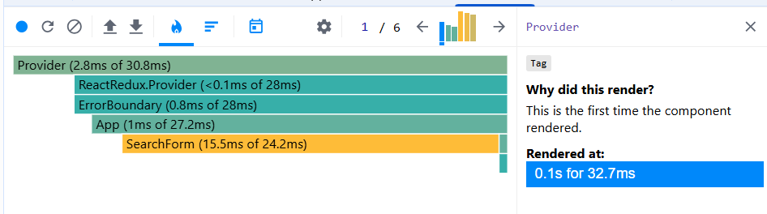
  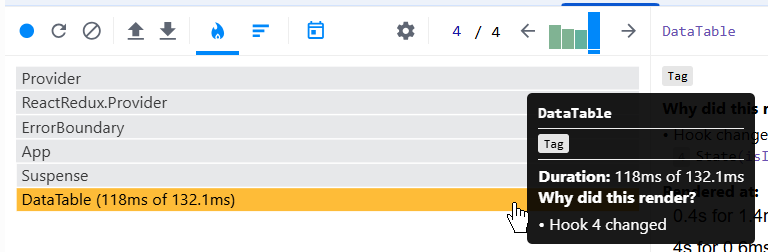
##### After Optimization
  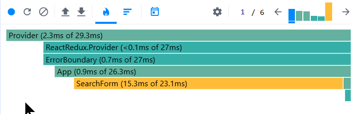
  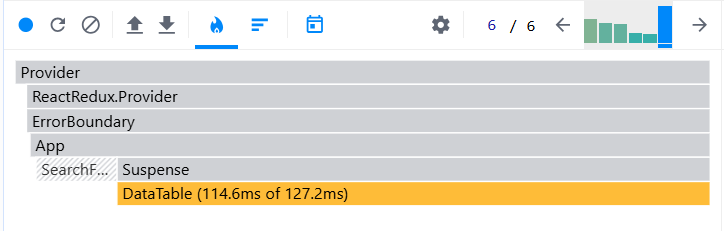
## 2. Render Duration:
|                     |  Render Duration before  | Render Duration after |
| ------------------- | ------------------ | --------------- |
|        Provider     |       2.8ms        |     2.3ms       |
|ReactRedux.Provider  |       0.1ms        |     <0.1ms      |
|    ErrorBoundary    |       0.8ms        |      0.7ms      |
|        App          |       1ms          |      0.9ms      |
|    SearchForm       |       15.5ms       |      15.3ms     |
|        DataTable    |       118ms        |     114.6ms     |
 

## 3. Interactions

| Interaction Type       | Component       | Before Optimization | After Optimization | Improvement (%) |
| ---------------------- | --------------- | ------------------- | ------------------ | --------------- |
| Sort by Name           | DataTable       |   130.7ms           | 108ms              |  82.63%         |
| Sort by Population     | DataTable       |   166.1ms           | 95.2ms             |  57.31%         |
| Another country        | DataTable       |   2.1ms             | 2.4ms              |  114%           |
| Another year           | DataTable       |   58.1ms            | 69ms               |  118%           |
| Adding/removing columns| DataTable       |   202.1ms           | 212ms              |  104%           |

## 4. Flame Graph
  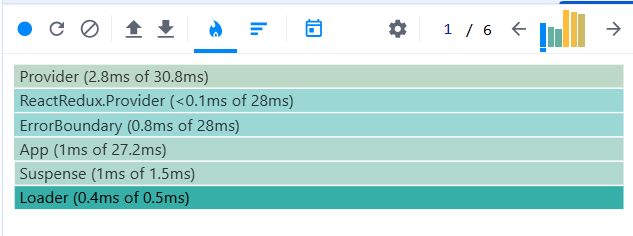

  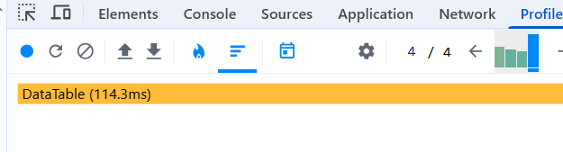

  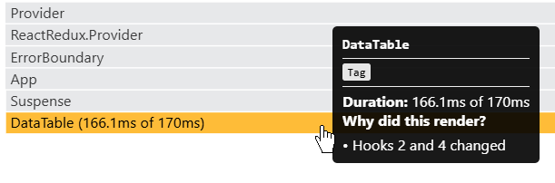
  ##### add columns 
  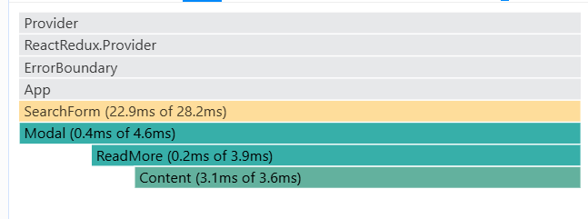
  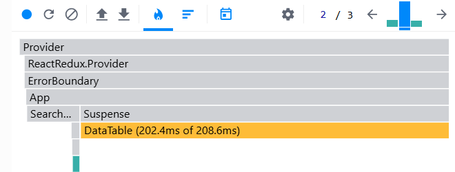
  ##### After optimisation
  ##### sort by name
  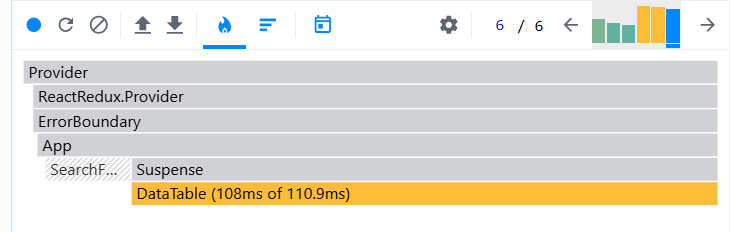
  ##### sort by population
  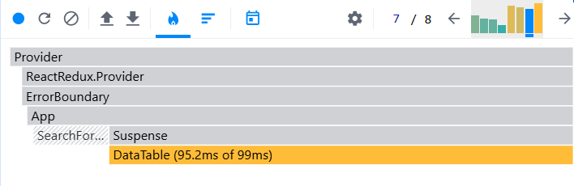
  ##### add columns 
  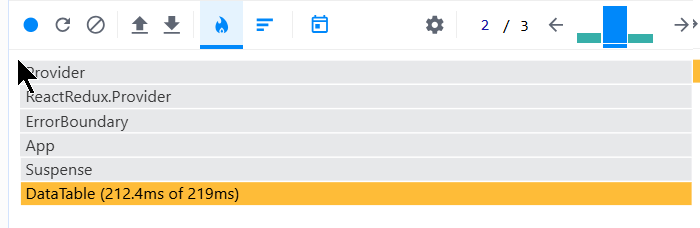
  ##### another country
  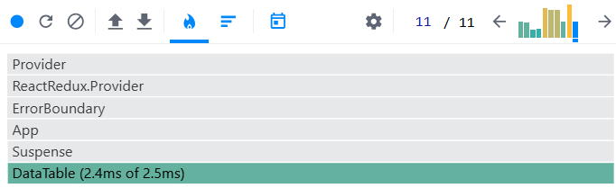
 ##### another Year
  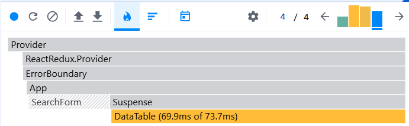

## 5. Ranked Chart
  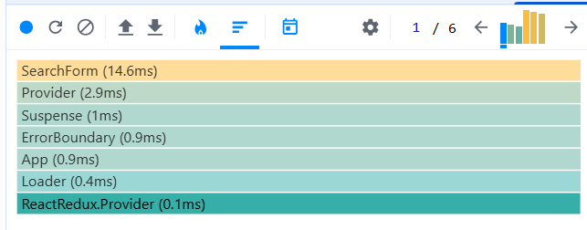
  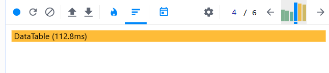
  ##### add columns 
  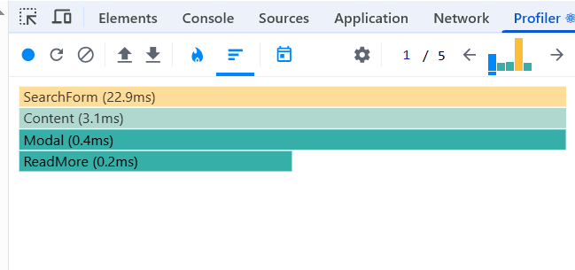
  ##### another country
  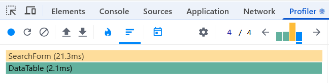
  ##### another Year
  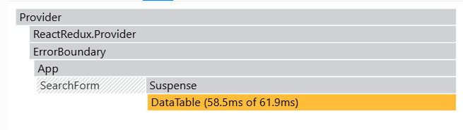

 ##### After optimisation
  ##### sort by name
  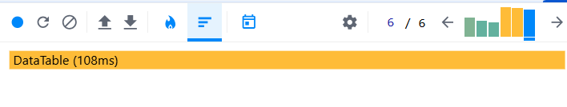
  ##### sort by population
  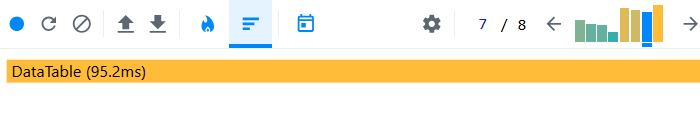
  ##### add columns 
  
  ##### another country
  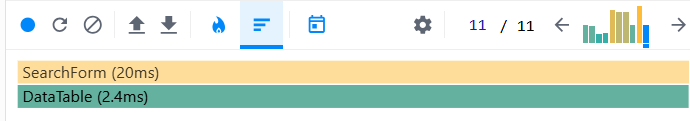
 ##### another Year
  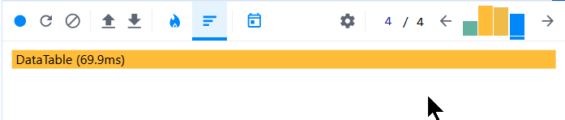

## Conclusion

After optimization (with useMemo, useCallback) resulted in major improvements in render efficiency:
`useMemo` optimized expensive computations (filtering, column selection).

`useCallback` memoized functions to prevent redundant re-creations:
 Prevention of unnecessary rewarders - functions are not relaxed at each rendere;
 Stable links to functions - the components of the extent are not transcended without the need;
 Optimized dependencies are the exact arrays of dependencies for each callback;
 Memoized formatting - formatting functions are cached. 

